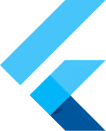

<h2>
	My name is Matheus, a FullStack Developer • Data Analyst
</h2>

  

 

## 🚀 &nbsp;Some Tools I Have Used and Learned

## About me

-  Hello! My name is Matheus D. Santos, I'm a FullStack Developer and Data Analyst. I'm currently graduating in Information Systems.  
-  My current goal is to become a Software Developer and Data Analyst. 
-  My main stack is Python, but I'm really into Java and Flutter nowadays. 
-  I always do my best when I'm working on something and try to help as much as possible. 

## 📌 &nbsp;Pinned Repositories

<table>
	<thead>
		<tr>
			<th colspan="2" width="2000">&nbsp;</th>
		</tr>
	</thead>
	<tbody>
		<tr>
			<td align="center" valign="top" width="80"> 
			
      </td>
			<td valign="top">
			<h3>Projeto de IHM</h3>
			
A game that I've developed through a discipline at college.

			
			</td>
		</tr>
		<tr>
			<td align="center" valign="top" width="80"> 
			
      </td>
			<td valign="top">
			<h3>Flutter Project</h3>
			
An incredible project made in Flutter.

			</td>
		</tr>
	</tbody>
</table>

## 🛫 &nbsp;My current streak

<h3>Contact Me</h3>

  
Credits
 
  - GitHub Stats by <a href="https://github.com/anuraghazra/github-readme-stats">anuraghazra</a>
   
   - GitHub Streak by <a href="https://github.com/DenverCoder1/github-readme-streak-stats">DenverCoder1</a>
	 
   - GitHub Cool GIFs by <a href="https://github.com/Anmol-Baranwal/Cool-GIFs-For-GitHub">Anmol-Baranwal</a>
   
  - Developer vector created by <a href="https://www.freepik.com/vectors/developer">storyset - www.freepik.com</a> (edited by author)
   
  - Some vectors and images also got at <a href="https://www.flaticon.com/"> www.flaticon.com</a>

